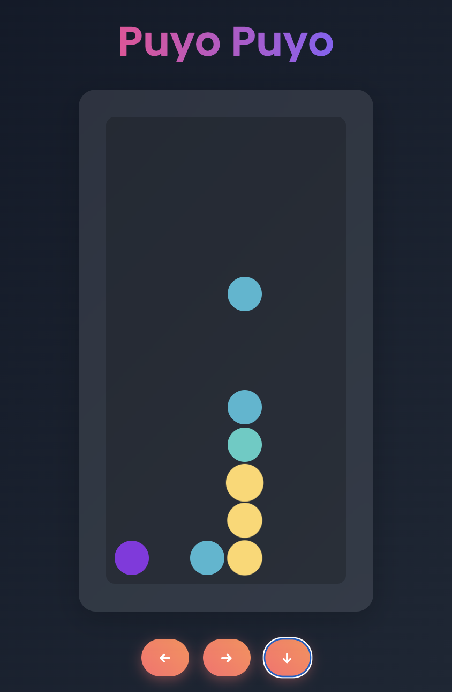

# Puyo Puyo Game

This is a simple implementation of the classic Puyo Puyo game using React and TypeScript.

[DEMO](https://chasesan.github.io/puyo-puyo-game/)



## Game Description

Puyo Puyo is a colorful puzzle game where players manipulate falling pairs of colored blobs ("Puyos"). The objective is to rotate and move these Puyos as they fall, forming groups of four or more same-colored Puyos, which then disappear. Chain reactions occur when clearing Puyos cause other Puyos to fall and form new groups.

### Game Features:

- Colorful Puyos falling from the top of the screen
- Left and right movement controls
- Hard drop function for quick placement
- Chain reaction mechanics
- Game over detection when the board fills up

## How to Play

- Use the left (←) and right (→) arrow buttons to move the falling Puyo.
- Use the down (↓) arrow button to perform a hard drop.
- Form groups of four or more same-colored Puyos to clear them.
- Try to set up chain reactions for higher scores.
- The game ends when Puyos stack up to the top of the board.

## Local Build and Run Instructions

To build and run this game locally, follow these steps:

1. Clone the repository:
   ```
   git clone <repository-url>
   cd puyo-puyo-game
   ```

2. Install dependencies:
   ```
   npm install
   ```

3. Start the development server:
   ```
   npm start
   ```

4. Open your browser and navigate to `http://localhost:3000` to play the game.

## Build for Production

To create a production build, run:

```
npm run build
```

This will create a `build` directory with optimized production-ready files.

## Technologies Used

- React
- TypeScript
- Tailwind CSS

Enjoy playing Puyo Puyo!
